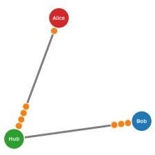

# BeadNet
A visualisation library for peer-to-peer payment channel networks.

*This software is in a very eary stage of development! Even basic functionallity is still broken and brakeing changes may occure at eny time.*

## Documenatation
* [JSDocs](./docs/)

## Examples

### Basic Examples
* [Adding and Removing Nodes](./examples/basic/nodes.html)
* [Adding and Removing Channels](./examples/basic/channels.html)
* [Creating and moving Beads](./examples/basic/beads.html)

### Simulations
* [Auto Adding and Removing Channels](./examples/simulations/channels.html)

## License

Copyright (C) 2018 [Alexander Wunschik](//github.com/mojoaxel)

**This program is free software**: you can redistribute it and/or modify it under the terms of the GNU Affero General Public License as published by the Free Software Foundation, either version 3 of the License, or (at your option) any later version.

This program is distributed in the hope that it will be useful, but WITHOUT ANY WARRANTY; without even the implied warranty of MERCHANTABILITY or FITNESS FOR A PARTICULAR PURPOSE. See the GNU Affero General Public License for more details.

You should have received a copy of the GNU Affero General Public License [along with this program](LICENSE).